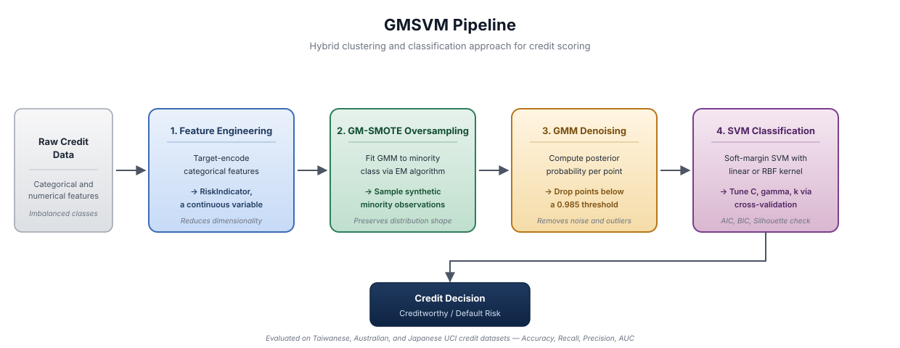
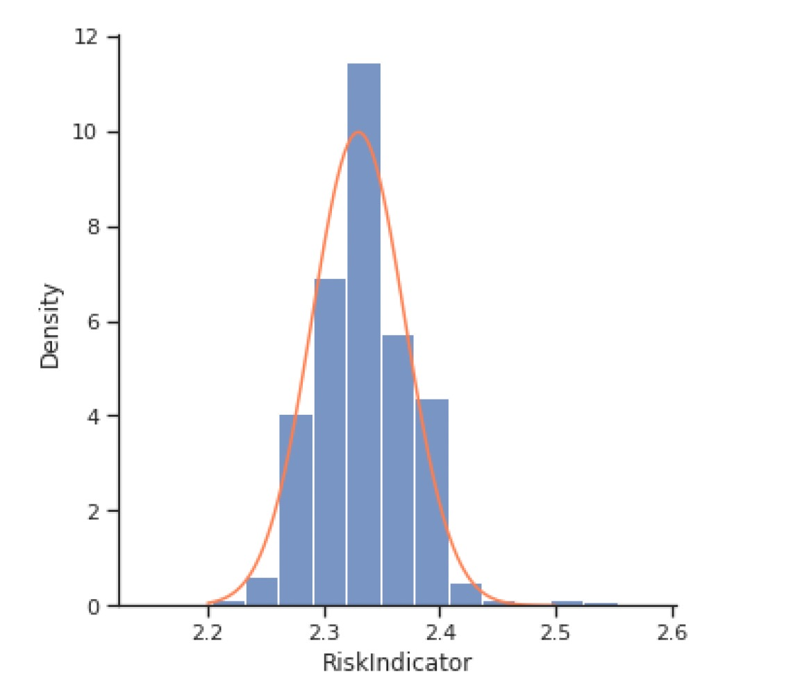
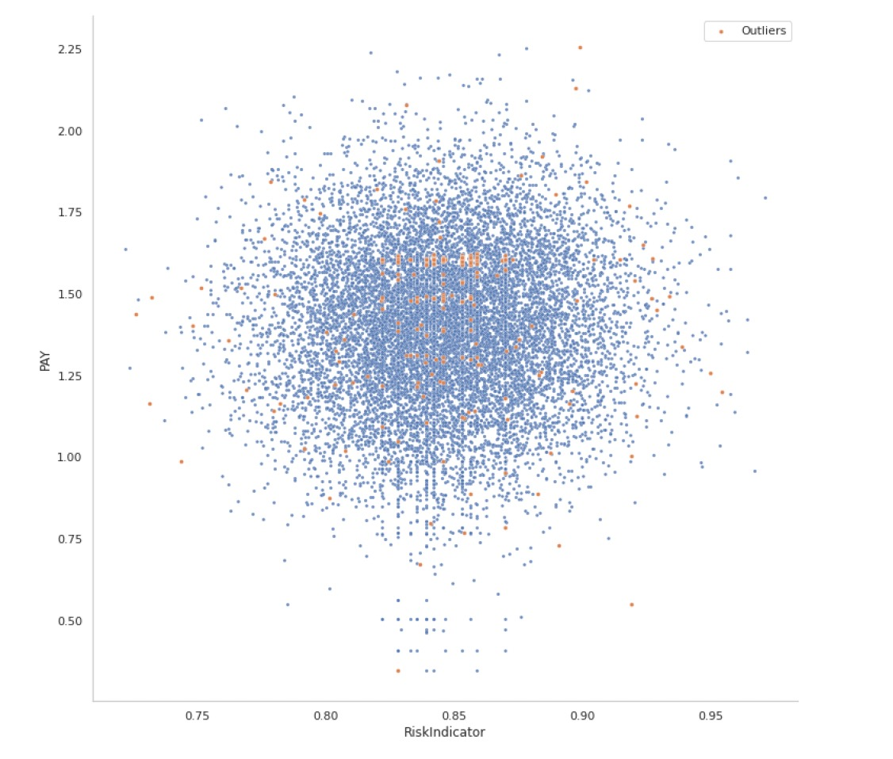

# Gaussian Mixture Support Vector Machines (GMSVM) for Credit Scoring

A hybrid machine learning model for classifying loan applicants as creditworthy or high-risk. GMSVM combines Gaussian Mixture Models (GMM) with Support Vector Machines (SVM) to handle the two practical pain points of real-world credit data: severe class imbalance and noisy observations. On three standard credit datasets (Taiwanese, Australian, Japanese), GMSVM matches or beats common benchmarks including Logistic Regression, kernel SVM, Random Forest, Gradient Boosting, and Bagging on test-set Accuracy, Recall, Precision, and AUC.

This repository accompanies a research paper I co-authored at Sharif University of Technology (working manuscript, not currently published).

<p align="center">
  
  <br>
  <em>Figure 1. GMSVM pipeline: feature engineering, GM-SMOTE oversampling, GMM denoising, SVM classification.</em>
</p>


## Business Problem

Banks, fintechs, and consumer lenders need to decide who gets approved for credit and on what terms. A misclassified applicant is not a rounding error. Approving a defaulter creates direct loss; rejecting a good customer is foregone revenue and a worse customer experience. Hand and Henley (1997) note that even a 1% gain in classification accuracy translates into material profit improvement at portfolio scale.

Two structural problems make this hard:

- **Class imbalance.** Defaulters are the minority. Naive classifiers learn to predict the majority class and miss the cases that actually cost money.
- **Noisy, mixed-type data.** Credit files mix categorical attributes (marital status, education, employment) with continuous attributes (balances, ratios, utilization), and contain outliers that distort decision boundaries.

GMSVM is designed around both constraints.

## Why GMSVM

Standard fixes for imbalance such as SMOTE generate synthetic minority observations by linear interpolation between neighbors. This ignores the underlying distribution of the minority class and tends to push synthetic points onto class borders, encouraging overfitting.

GMSVM replaces this with a two-step procedure built on Gaussian Mixture Models:

1. **GM-SMOTE oversampling.** Fit a GMM to the minority class, then sample new observations from the fitted mixture. The resulting synthetic data preserves the shape of the minority distribution rather than smearing it.
2. **GMM-based denoising.** Fit a GMM to each class and drop observations whose posterior probability falls below a threshold (0.985 in this study). This removes noisy points that destabilize the SVM margin.

The cleaned, balanced training set is then fed to a soft-margin SVM. The pipeline gives the classifier realistic borderline information and a less overfit training signal.

## Methodology Summary

The pipeline has four stages:

- **Feature engineering.** Categorical variables are transformed into a continuous `RiskIndicator` using a target-encoding scheme (Micci-Barreca, 2001). Three to six related categoricals collapse into one continuous feature that approximately follows a normal distribution. This both reduces dimensionality and produces a feature GMM can model cleanly.

<p align="center">
  
  <br>
  <em>Figure 2. RiskIndicator distribution after collapsing three categorical features (sex, education, marriage) on the Taiwanese dataset, split by default outcome.</em>
</p>

- **GM-SMOTE oversampling.** GMM is fit by Expectation-Maximization. Synthetic minority samples are drawn proportionally from each component until classes are balanced.

<p align="center">
  
  <br>
  <em>Figure 3. SMOTE generates synthetic points by linear interpolation between neighbors. GM-SMOTE samples from the fitted Gaussian mixture and preserves the shape of the minority distribution.</em>
</p>

- **GMM denoising.** Posterior probabilities are computed for every training observation. Points below the 0.985 threshold are removed.

<p align="center">
  
  <br>
  <em>Figure 4. Outlier detection using posterior probability with a 0.985 threshold. Extreme noise is removed while the realistic class structure is preserved.</em>
</p>

- **Soft-margin SVM classification.** The cleaned, balanced training set trains a linear or RBF-kernel SVM. Hyperparameters (`C`, `gamma`, number of GMM components) are selected by cross-validation, with component count cross-checked against AIC, BIC, and Silhouette score.

## Datasets

All three datasets are public benchmarks from the UCI Machine Learning Repository:

| Dataset    | Size   | Class Balance | Features (Cat / Num) | Use Case            |
|------------|--------|---------------|----------------------|---------------------|
| Taiwanese  | 29,999 | 78 : 22       | 23 (9 / 14)          | Behavioral scoring  |
| Australian | 690    | 56 : 44       | 14 (8 / 6)           | Application scoring |
| Japanese   | 690    | 56 : 44       | 15 (9 / 6)           | Application scoring |

The Taiwanese set is the most industry-relevant: it is the largest and the most imbalanced, which is the regime real lenders actually operate in.

## Results

GMSVM is benchmarked against Linear SVM, Logistic Regression, kernel SVM, Gradient Boosting, Bagging, and Random Forest. Selected test-set metrics:

| Dataset    | Model           | Accuracy | Recall | Precision | AUC  |
|------------|-----------------|----------|--------|-----------|------|
| Australian | **GMSVM**       | **0.90** | **0.93** | **0.91** | 0.92 |
| Australian | Random Forest   | 0.88     | 0.91   | 0.90      | 0.94 |
| Japanese   | **GMSVM**       | **0.89** | **0.92** | 0.89   | **0.91** |
| Japanese   | Kernel SVM      | 0.84     | 0.86   | 0.87      | 0.88 |
| Taiwanese  | **GMSVM**       | **0.81** | **0.92** | 0.84   | 0.73 |
| Taiwanese  | Linear SVM      | 0.54     | 0.49   | 0.85      | 0.64 |
| Taiwanese  | Gradient Boost. | 0.79     | 0.87   | 0.87      | **0.77** |

<p align="center">
  
  <br>
  <em>Figure 5. GMSVM compared with benchmark models.</em>
</p>


Highlights:

- GMSVM has the highest test-set Accuracy and Recall on all three datasets.
- The largest improvement is on the Taiwanese set, the most imbalanced and the most representative of production credit portfolios.
- GMSVM generalizes well: its training accuracy is lower than ensemble models, but its test accuracy is higher. This is the expected effect of feeding the SVM a more realistic, less overfit training set.
- A separate ablation shows that swapping SMOTE for GM-SMOTE inside other models (Bagging, Random Forest, Gradient Boosting, Logistic Regression) also lifts test accuracy in most cases. The oversampling method is useful as a standalone component.

## Why This Project Matters

This work targets problems risk teams deal with daily:

- **Default prediction at portfolio scale.** Better discrimination between good and bad borrowers reduces credit losses without tightening approvals so much that profitable customers are rejected.
- **Imbalanced data is the norm.** Default rates are typically single-digit percentages. Any production scorecard has to handle this. GM-SMOTE is a plug-in component that can be reused inside existing pipelines.
- **Interpretability for review and governance.** The `RiskIndicator` feature engineering step compresses categorical attributes into a continuous, distribution-aware variable that is straightforward to inspect and discuss with credit officers and regulators.
- **Lower computational cost than full nonlinear ensembles.** GMSVM is a simpler model than tuned Random Forests or boosted ensembles and gets comparable or better out-of-sample performance, which matters for retraining cadence and explainability.

The methods generalize beyond consumer credit. The same imbalance-and-noise problem appears in fraud detection, churn modelling, anti-money-laundering alerts, and loan-loss provisioning.

## Skills Demonstrated

- **Credit risk modelling.** Application scoring, behavioral scoring, default classification.
- **Machine learning.** Supervised classification (SVM, Logistic Regression, ensemble trees), unsupervised clustering (GMM), hyperparameter tuning, cross-validation.
- **Imbalanced learning.** SMOTE, GM-SMOTE, oversampling vs. undersampling trade-offs.
- **Statistical modelling.** Gaussian mixture density estimation, Expectation-Maximization, posterior-probability outlier detection, model selection by AIC/BIC/Silhouette.
- **Feature engineering.** Target encoding, dimensionality reduction, categorical-to-continuous transformation.
- **Model evaluation.** Accuracy, Recall, Precision, AUC/ROC, train-vs-test diagnostics for overfitting.
- **Quantitative research workflow.** Literature review, methodology design, benchmarking against standard models, reproducible empirical study, written communication of results.
- **Python data stack.** scikit-learn, NumPy, pandas, matplotlib.


## How to Run

> The repository has been used as research code. The instructions below describe the intended workflow; adapt to the entry points in your local copy.

**Requirements:** Python 3.9+, with `scikit-learn`, `numpy`, `pandas`, `matplotlib`, and `imbalanced-learn`.

```bash
# 1. Clone
git clone https://github.com/SaeedShadkam/Gaussian-Mixture-Support-Vector-Machines-GMSVM.git
cd Gaussian-Mixture-Support-Vector-Machines-GMSVM

# 2. Install dependencies
pip install -r requirements.txt

# 3. Train and evaluate GMSVM on a chosen dataset
python src/gmsvm.py --dataset taiwanese
python src/gmsvm.py --dataset australian
python src/gmsvm.py --dataset japanese

# 4. Reproduce benchmark comparisons
python src/benchmarks.py --dataset taiwanese
```

Each run reports test-set Accuracy, Recall, Precision, and AUC, and writes figures to `results/`.

## Potential Extensions

- **Adaptive component count.** The current implementation uses a fixed number of GMM components per class. Treating it as a tuned hyperparameter (or selecting per-class via BIC) could further improve fit on heterogeneous portfolios.
- **Calibrated probabilities.** Convert SVM scores to calibrated default probabilities (Platt scaling, isotonic regression) so the output can feed directly into expected-loss and pricing models.
- **Cost-sensitive learning.** Replace symmetric accuracy with an expected-loss objective that reflects the asymmetric cost of false approvals vs. false rejections.
- **Time-aware validation.** Add walk-forward validation on the Taiwanese behavioral data to test stability under macroeconomic shifts.
- **Explainability layer.** Pair GMSVM with SHAP or counterfactual explanations to support adverse-action notices and model risk review.
- **Application beyond credit.** Stress-test GM-SMOTE on fraud detection, AML alert triage, and insurance claim classification, where imbalance and noise dominate.

## Reference

If you require full access to the submitted paper, please contact me directly.
## Author

**Saeed Shadkam**
GitHub: [@SaeedShadkam](https://github.com/SaeedShadkam)
